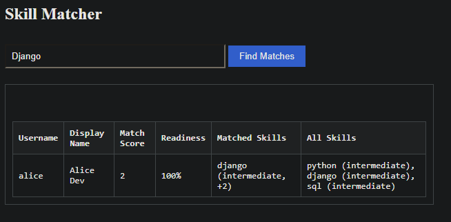
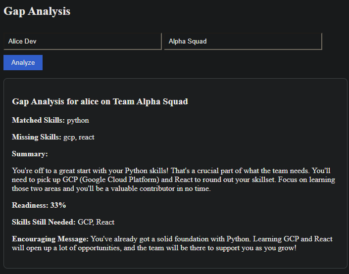
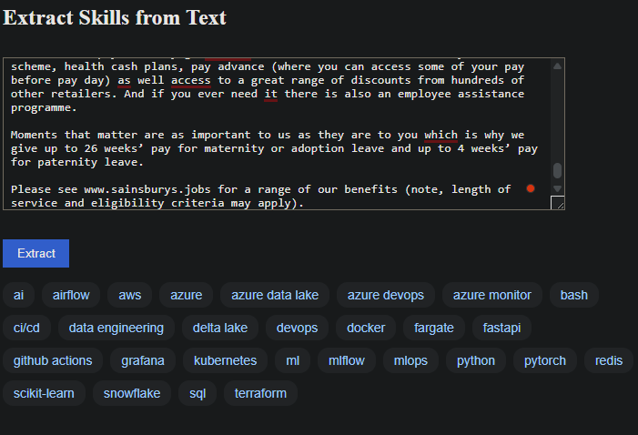

#  SkillMatch – Team Skill Intelligence Platform

SkillMatch is a Django + DRF + Gemini AI–powered web application that intelligently matches users to teams based on their technical skills, identifies skill gaps, and performs AI-driven extraction of skills from free-form text (like resumes or job descriptions). It is designed to showcase Django backend skills, RESTful APIs, LLM integration, and frontend interaction.

---

##  Features

### Feature Showcase
Below are example screenshots from a working SkillMatch instance demonstrating the key features of the application.

#### Skill Matcher
The Skill Matcher compares user skills against a query and displays match score, readiness percentage, and details of both matched and unmatched skills.



#### Skill Gap Analysis (LLM-Powered)
Compare a user's skills with a team's requirements. A Gemini-powered summary explains readiness and provides an encouraging message. Input is based on display name and team name.




#### Extract Skills from Text
Paste in a job description, resume, or listing. Gemini AI extracts technical skills and displays them visually as badge tags.




###  User & Team Management
- Custom `User` model with `display_name` and `skills`
- Skills assigned via `UserSkill` model with levels and experience
- `Team` model with `required_skills` and membership via `TeamRole`
- Roles: Developer, Product Manager, QA

###  RESTful API
- Full CRUD via DRF for:
  - `/api/users/`
  - `/api/skills/`
  - `/api/teams/`
- Custom endpoints:
  - `/api/match/?skills=python,django`
  - `/api/skill-gap/`
  - `/api/extract-skills/`
  - `/api/register/`

###  AI-Enhanced Features
-  **Skill Matching API**: score users against required skills
-  **Skill Gap AI Summary**: Gemini generates readiness analysis
-  **Skill Extractor**: extract skills from resumes/job posts via Gemini LLM

###  Web Interface
- `/dashboard/`: Central entry point with navigation
- `/match/`: Match users to skills (visual table)
- `/gap-analysis/`: Name-based gap analysis with Markdown support
- `/extract-skills/`: Text input → dynamic skill badges

---

## ️ Tech Stack

| Component         | Details                               |
|------------------|----------------------------------------|
| Backend          | Django 5.2, Django REST Framework      |
| Frontend         | Plain HTML, JavaScript, CSS            |
| Auth             | Django sessions + CSRF or TokenAuth    |
| AI Integration   | Google Gemini Pro via `google.generativeai` |
| Database         | SQLite (default)                       |
| Deployment       | Dev server (runserver) or Docker-ready |
| Styling          | Custom CSS + Flexbox + Badges          |

---

##  Setup Instructions

### 1. Clone the Repo

```bash
git clone https://github.com/yourusername/skillmatch.git
cd skillmatch
```

### 2. Create & Activate Virtual Environment

```bash
python -m venv venv
source venv/bin/activate   # or venv\Scripts\activate on Windows
```

### 3. Install Dependencies

```bash
pip install -r requirements.txt
```

> Required: Python 3.10+ and Django 5.2+

### 4. Environment Variables

Create a `.env` file:
```env
GOOGLE_API_KEY=your-gemini-api-key
```

> You must use [Google's Gemini API](https://makersuite.google.com/) for LLM-powered features.

### 5. Run Migrations

```bash
python manage.py migrate
```

### 6. Create Superuser (optional)

```bash
python manage.py createsuperuser
```

### 7. Seed Test Data

```bash
python manage.py seed
```

This creates:
- Users: `alice`, `bob`, `charlie` (all `test1234`)
- Team: `Alpha Squad`
- Skills: `python`, `django`, `sql`, `react`, `gcp`, `javascript`

---

## Running the Project

```bash
python manage.py runserver
```

Then visit: [http://127.0.0.1:8000/dashboard/](http://127.0.0.1:8000/dashboard/)

---

##  Pages & Navigation

| URL                  | Purpose                          |
|----------------------|----------------------------------|
| `/dashboard/`        | Entry point                      |
| `/match/`            | Skill Matcher UI                 |
| `/gap-analysis/`     | User/team skill gap evaluator    |
| `/extract-skills/`   | Extract from text via Gemini     |
| `/login/`            | Django login page                |
| `/admin/`            | Admin panel                      |

---

##  Project Structure

```
skillmatch/
│
├── team/
│   ├── models.py            # User, Skill, Team, TeamRole, UserSkill
│   ├── serializers.py       # DRF serializers
│   ├── views.py             # API + HTML views
│   ├── urls.py              # All routes (HTML + API)
│   ├── templates/
│   │   ├── dashboard.html
│   │   ├── skill_match.html
│   │   ├── gap_analysis.html
│   │   └── extract_skills.html
│   └── static/css/style.css # Custom styling
│
├── seed.py                 # Create users, skills, team, roles
├── settings.py             # Django config (CSRF, auth, REST)
└── requirements.txt        # Django, DRF, generativeai
```

---

##  LLM Integration (Gemini)

We use Gemini Pro 1.5 for:
- Natural skill extraction from text
- Readiness and gap analysis summaries

The responses are auto-parsed into usable lists or Markdown-formatted HTML with fallbacks.

---

##  Authentication Notes

By default:
- **Web pages use Django sessions + CSRF**
- **API endpoints require login**
- `/api/register/` returns a token if using token auth

---

##  Models Overview

```python
User          # Custom auth user with display_name
Skill         # Single skill (e.g. "python")
UserSkill     # M2M: User ↔ Skill with level, years, active
Team          # Team with required_skills
TeamRole      # M2M: User ↔ Team with role (dev, pm, qa)
```

---

##  Sample API Response

### `/api/match/?skills=python,django`
```json
[
  {
    "username": "alice",
    "match_score": 4,
    "skills_matched": [
      { "skill": "python", "level": "intermediate" }
    ],
    "readiness_score": "67%"
  }
]
```

---

##  Gemini Prompt Examples

For extraction:
```
Extract and return a list of programming and technical skills mentioned in this text.
Return only a Python list of lowercase skill names, like: ['django', 'react', 'gcp']
```

For gap analysis:
```
User has: python, django
Team requires: python, gcp, react
Write a summary of readiness and missing skills
```

---

##  Future Improvements

-  Editable user profile UI
-  Auto-suggest skills based on free text
-  Drag-and-drop team builder
-  Export to CSV or PDF
-  Frontend refactor with React or HTMX

---

##  License

MIT License © 2025 Mahrad Var